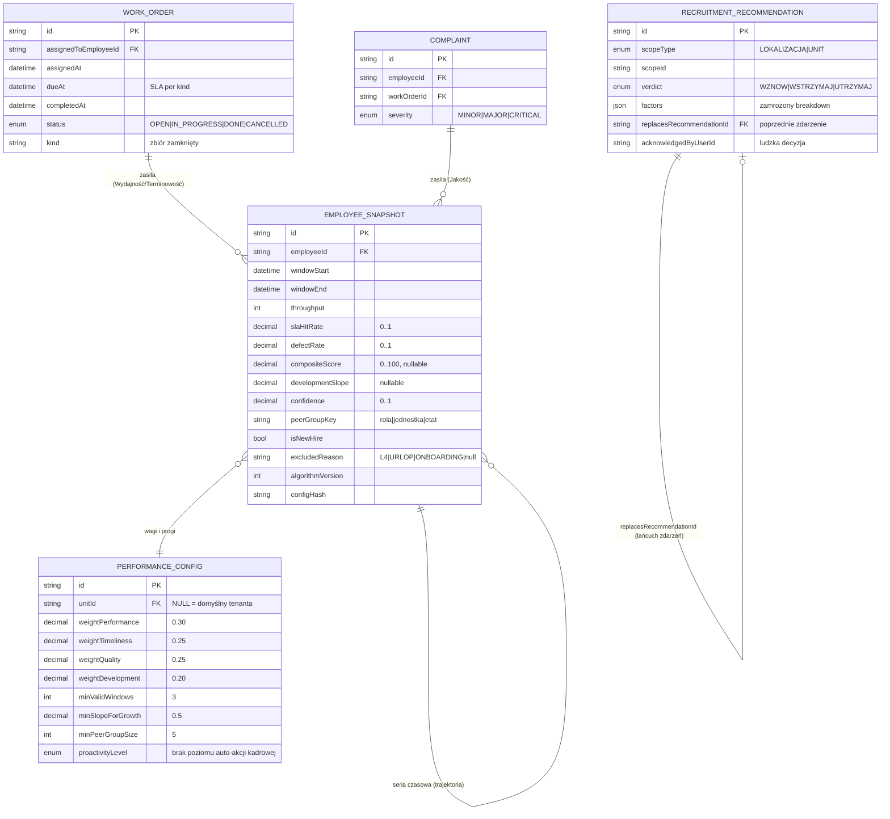
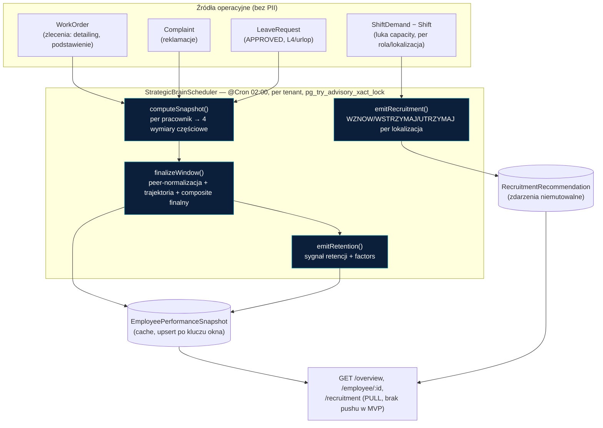
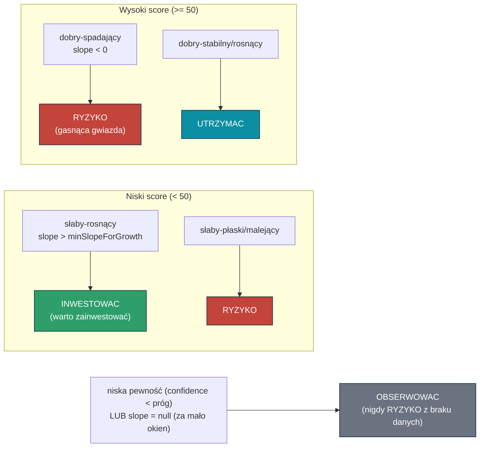

# l) Implementacja Modułu Analityk HR (Agent AI) — ciągła analiza wydajności, trajektoria rozwoju, autonomiczna rekomendacja rekrutacji

> **Punkt programu:** l) Implementacja Modułu Analityk HR (Agent AI) obejmująca: pomiar wydajności/terminowości/jakości/rozwoju pracowników, wyjaśnialną trajektorię rozwoju oraz autonomiczne, proaktywne rekomendacje strategiczne (retencja + rekrutacja per lokalizacja) — z twardą granicą ludzkiej decyzji (art. 22 RODO)
> **Kamień milowy:** M3 (do 2026-08-20) · **Projekt:** HRobot.AI
> **Beneficjent:** App Pro sp. z o.o. (0035/2026) · **Odbiorca Technologii:** 4Mobility
> **Wersja:** 1.0 · **Status:** Zaimplementowany — live-verified · **Klasyfikacja:** Poufne · **Data:** 2026-07-21
> **Identyfikowalność:** `apps/tenant-runtime/src/strategic-brain/` (silnik + API), `docs/design/web-kit/app/(tenant)/analiza/` + `components/strategic-brain/*` (UI), SPEC `docs/superpowers/specs/2026-07-14-ai-performance-trajectory-recruitment-SPEC.md`, weryfikacja live `docs/demo/strategic-brain-live-verification.md`

---

## 1. Cel modułu

Moduł Analityk HR to **strategiczny mózg kadrowy** HRobot: warstwa, która **ciągle i autonomicznie** — bez ręcznego wyzwalania — mierzy cztery wymiary pracy każdego pracownika (Wydajność, Terminowość, Jakość, Rozwój), wylicza **trajektorię rozwoju** w czasie i **sama z siebie** dostarcza wyjaśnialne rekomendacje strategiczne:
1. **Sygnał retencji** per pracownik (`UTRZYMAC`/`OBSERWOWAC`/`RYZYKO`/`INWESTOWAC`).
2. **Rekomendację rekrutacji** per lokalizacja (`WZNOW`/`WSTRZYMAJ`/`UTRZYMAJ`), wyprowadzoną z realnej luki obsady (zapotrzebowanie grafiku minus przypisane zmiany).

Każda z tych rekomendacji jest **analizą, nie akcją** — nieodwracalną decyzję kadrową (np. zwolnienie, wstrzymanie rekrutacji) zawsze zatwierdza człowiek (RODO art. 22). Backend: `apps/tenant-runtime/src/strategic-brain/` (moduł Nest, prefiks API `/api/strategic-brain/*`, za `RbacGuard`). UI: `docs/design/web-kit/app/(tenant)/analiza/` (heatmapa, karta pracownika ze sparkline trajektorii, panel rekrutacji, stały baner RODO).

## 2. Model danych (tenant Prisma, greenfield — zero PII)

**Decyzje projektowe (wynik przeglądu adversarialnego SPEC §14 — Codex crosscheck, 6 BLOCKER + 14 MAJOR, wszystkie naniesione przed buildem):**
- `EmployeePerformanceSnapshot` to **zmaterializowany cache**, nie fakt audytowy: `upsert` po `[employeeId, windowStart, windowEnd]` świadomie **nadpisuje** przy przeliczeniu; `algorithmVersion`+`configHash` znaczą, którym silnikiem/konfiguracją policzono wiersz. Każda wydana rekomendacja **zamraża własny `factors` (Json)** w chwili wydania — nie zależy od bieżących wag.
- `RecruitmentRecommendation` to **niemutowalne zdarzenia** (`replacesRecommendationId`), nie mutacja przez `supersededAt` — jedyny prawdziwy append-only w repo to `audit_log` z triggerem. „Aktualna" = najnowsze zdarzenie per `(scopeType, scopeId)`.
- `PerformanceConfig`: wiersz domyślny (`unitId IS NULL`) chroniony **partial unique index** (Postgres dopuszcza wiele `NULL` w zwykłym `@@unique`) + P2002-recovery w serwisie (wzór `AiConfigService`).
- Luka rekrutacyjna liczona z **danych persystowanych** (`ShiftDemand.requiredCount` minus przypisane `Shift`), nie z efemerycznego wyjścia solvera grafiku — deterministyczna i reprodukowalna z bazy.
- Zero PII w tabelach operacyjnych: tylko `employeeId` + metryki liczbowe (moduł nazwany świadomie „strategic-brain", nie „performance", by nie sugerować oceny pojedynczej metryki).

## 3. Silnik scoringu — cztery wymiary (czyste funkcje, `scoring.util.ts`)

| Wymiar | Wzór | Null-policy |
|--------|------|-------------|
| **Wydajność** | peer-normalizowany `throughput` (percentyl mid-rank w grupie `rola\|jednostka\|etat`, z drabinką fallbacku M10) | brak peerów → `null`; grupa < `minPeerGroupSize`(5) → wynik liczony, ale `meaningful:false` (kara pewności) |
| **Terminowość** | `slaHitRate` = frakcja zleceń `DONE` z `completedAt ≤ dueAt` (SLA per rodzaj zlecenia) | brak ukończonych zleceń → `null` (brak danych, NIE zerowa terminowość) |
| **Jakość** | `1 − defectRate`, `defectRate = reklamacje / ukończone` | `completedCount < 1` → `null` (minimalny mianownik, M7) |
| **Rozwój** | `developmentSlope` — regresja liniowa (OLS) `compositeScore` w czasie, z pominięciem okien `excludedReason≠null`, zmapowana na skalę 0..100 (płasko=50) | seria < `minValidWindows`(3) ważnych okien → `null` (M9: **null ≠ płaski trend** — nigdy nie zamieniane w sygnał ryzyka) |

`compositeScore(dims, weights)` — ważona suma 0..100 z **renormalizacją wag** po obecnych wymiarach (M8): brakujący wymiar jest wykluczony, a pozostałe wagi przeskalowane do sumy 1; przy < 2 obecnych wymiarach wynik to `null` (zbyt mało sygnału na liczbę), nie połowiczny score. Wagi domyślne: Wydajność 0.30 / Terminowość 0.25 / Jakość 0.25 / **Rozwój 0.20** (pełnoprawny wymiar, ale nie dominujący) — walidowane w `PerformanceConfigService` (Σ=1.00, tolerancja 1e-6).

`confidence(sampleN, daysEmployed, minDays)` — **multiplikatywnie** (nie średnia) z liczności próby i stażu: mały N zostaje niską pewnością nawet przy długim stażu i odwrotnie — „za mało obserwacji" nigdy nie jest maskowane przez „ale pracuje tu długo".

## 4. Przepływ danych i autonomia (scheduler „sam z siebie")

- **Cykl:** `@Cron(EVERY_DAY_AT_2AM)` — nightly, off-hours; iteruje tenanty `ACTIVE` (`ControlPlanePrismaService`), per tenant bierze połączenie przez `TenantPrismaManager.withClient` i chroni przebieg `pg_try_advisory_xact_lock` (nieblokujący, transakcyjny) — jeśli inny przebieg trzyma blokadę, ten tenant jest **pomijany w tej rundzie** (brak pracy, brak błędu, brak oczekiwania), zamiast dublować przeliczenie.
- **Kolejność w tenancie:** snapshot każdego pracownika → `finalizeWindow` (trajektoria + composite finalny) → `emitRetention` → `emitRecruitment` per lokalizacja.
- **Idempotencja:** okna wyrównane do stałych granic epoki (`floor(now/windowMs)*windowMs`) — powtórne uruchomienie w tym samym oknie nadpisuje ten sam wiersz cache (nie duplikuje); rekomendacje mają deduplikację po treści (verdict + istotne `factors` bez zmian → brak nowego zdarzenia, B4).
- **Feed = PULL, nie push:** `NotificationsService` nie istnieje w tym repo (M2), więc „sam z siebie" oznacza: scheduler liczy w tle bez ręcznego wyzwalania, a UI serwuje już-policzone dane przez `GET /overview` w momencie otwarcia ekranu. `PROAKTYWNE_ALERTY` pozostaje w enumie `proactivityLevel` jako pozycja roadmapy, bez implementacji pushu — kryteria akceptacji od tego nie zależą.

## 5. Kluczowe rozróżnienie: poziom vs trend (`retentionSignal`)

Rdzeniem modułu jest odróżnienie **ile pracownik dowozi dziś** (poziom, `compositeScore`) od **w którą stronę to idzie** (trend, `developmentSlope`) — te dwa wymiary łącznie dają cztery jakościowo różne sytuacje:

Dowód na żywo (`docs/demo/strategic-brain-live-verification.md`, tenant `hrobot_t_900d948b`): 6 profili trajektorii pokazują wszystkie ścieżki jednocześnie — np. **Rafał Adamczyk** (composite 66, slope −6,70) = `RYZYKO` (dobry-spadający), podczas gdy **Marcin Dąbrowski** (composite 45, slope +6,80) = `INWESTOWAC` (słaby-rosnący). Bez rozróżnienia poziom-vs-trend obaj wyglądaliby jak przypadki „środkowe" — z trendem, zamieniają się w przeciwne rekomendacje strategiczne.

## 6. RBAC — trzy poziomy dostępu

| Endpoint | HR / ADMIN_KLIENTA | MANAGER | PRACOWNIK |
|---|---|---|---|
| `GET /overview` | pełny heatmap (wszyscy pracownicy) | **scoped** do `managedUnitIds` | 403 |
| `GET /employee/me` | — | — | 200, własna karta (self, przez `keycloakSub`) |
| `GET /employee/:id` | dowolny pracownik | tylko w zakresie jednostki (404→403 poza zakresem) | 403 (musi użyć `/me`) |
| `GET /recruitment` | wszystkie lokalizacje | scoped do zarządzanych jednostek | — |
| `POST /recruitment/:id/acknowledge` | tak | 403 | — |
| `GET`/`PATCH /config` | tak | 403 | — |

`RbacGuard` weryfikuje wyłącznie grube role z tokenu (`hrobot_roles`); **scoping jednostkowy jest realizowany na poziomie serwisu** (`managedUnitIds`, wzór `unit-scope.ts` z modułu Pracownicy) — kontroler przekazuje zakres jawnie do każdej metody serwisowej. Trasa `/employee/me` jest zadeklarowana **przed** `/employee/:id` (kolejność load-bearing — inaczej Nest próbowałby dopasować `me` jako `:id` i `ParseUUIDPipe` odrzuciłby żądanie z 400).

Weryfikacja live na 3 realnych kontach Keycloak (`demo`/`manager.demo`/`pracownik.demo`, tokeny direct-grant uderzające wprost w backend): macierz powyżej odtworzona 1:1, w tym manager widzący rekomendację `Region Centrum` (mapowanie `scope↔unit` z seedu) i pracownica widząca własną kartę (`Anna Kowalska`), a nie cudzą.

## 7. Rekomendacja rekrutacji (luka obsady, reprodukowalna)

Werdykt per lokalizacja liczony wyłącznie z danych persystowanych — nie z efemerycznego wyjścia solvera grafiku:

- **Luka capacity** = suma `ShiftDemand.requiredCount − liczba przypisanych Shift` per rola, w oknie 7-dniowym (ta sama konwencja tygodnia co solver grafiku). Wynik **nie jest przycinany do zera** — ujemna luka = nadobsada, sygnał osobny od niedoboru.
- **WZNOW** — istnieje luka (`totalGap > 0`).
- **WSTRZYMAJ** — obsada pokryta (`totalGap ≤ 0`) i metryki jakości/terminowości w normie.
- **UTRZYMAJ** — obsada pokryta, ale jakość (`defectRate > próg`) lub terminowość (`slaHitRate < 80%`) poniżej celu — adresować procesem, nie zwiększaniem obsady.
- Każde wydanie rekomendacji zamraża `factors` (luka per rola, średnie jakości/terminowości, progi) w JSON — decyzja jest odtwarzalna nawet po zmianie konfiguracji wag.
- Deduplikacja (B4): identyczny werdykt + niezmienione istotne czynniki → brak nowego zdarzenia przy kolejnym przebiegu schedulera.

Dowód live: 4 rekomendacje jednocześnie widoczne — `WZNOW` (Region Centrum, widoczne managerowi), `WZNOW` (lokalizacja z realną luką), `WSTRZYMAJ` (Region Południe), `UTRZYMAJ` (Region Północ).

## 8. Zgodność (RODO + odpowiedzialna AI / EU AI Act)

| Wymóg | Realizacja w module Analityk HR |
|-------|----------------------------------|
| **Art. 22 RODO — brak w pełni zautomatyzowanej decyzji** | Moduł **wyłącznie analizuje i rekomenduje**; `POST /recruitment/:id/acknowledge` loguje decyzję CZŁOWIEKA (`acknowledgedByUserId`), nie wykonuje żadnej akcji kadrowej. Twarda granica zapisu potwierdzona **statycznym testem architektonicznym** (`write-boundary.spec.ts`): skanuje każdy plik `.ts` modułu i fail'uje, jeśli jakikolwiek zapis Prisma dotyka `employee`/`shift`/`shiftDemand`/`aiProposal`/`aiProposalCandidate`/`leaveRequest`/`user`/`userRole`/`accessGrant` — moduł zapisuje wyłącznie do własnych tabel (`employeePerformanceSnapshot`, `recruitmentRecommendation`, `performanceConfig`). Baner „Rekomendacja AI — decyzję podejmuje człowiek" stały w UI (`components/strategic-brain/rodo-banner.tsx`). Enum `proactivityLevel` świadomie **nie zawiera** poziomu auto-akcji kadrowej. |
| **Wyjaśnialność** | Każdy score i sygnał rozbity na czynniki (`factors`: compositeScore, slope, confidence, slaHitRate, defectRate, throughput, isNewHire, excludedReason) — dostępne przez `GET /employee/:id`/`/me` i w rekomendacjach rekrutacji. „Rozwój" zdefiniowany jawnie: okno 14 dni, ≥3 ważne okna, próg `minSlopeForGrowth=0.5`. |
| **Uczciwość — brak cech chronionych (ALLOWLIST, nie denylist)** | `buildScoringInput()` przyjmuje **wyłącznie** jawnie wymienione klucze operacyjne (`throughput`, `completedCount`, `complaintCount`, `cycleMinutes`, `slaHits`, `peerGroupKey`, `hiredAt`) i **rzuca wyjątek** przy jakimkolwiek nieoczekiwanym kluczu — dowodzi braku proxy, nie tylko braku nazwy cechy. Test wymuszający: `scoring-input.spec.ts`. |
| **Normalizacja peer-group + ochrona małych/nowych grup** | `normalizeToPeerGroup` (percentyl mid-rank) z drabinką fallbacku `rola\|jednostka\|etat → rola\|jednostka → rola → global` (M10); grupa `< minPeerGroupSize(5)` liczy się, ale `meaningful:false` → kara pewności (mnożniki 0.85/0.7), UI ujawnia „grupa zbyt mała — normalizacja orientacyjna" (ochrona przed re-identyfikacją). |
| **Wykluczenia L4/urlop/onboarding z trendu** | `excludedReason` wyprowadzany **strukturalnie** — z przecięcia dat `LeaveRequest.APPROVED` (mapa typu→kategoria: „l4"/„chorob"→L4, „urlop"→URLOP) i okna onboardingu `[hiredAt, hiredAt+confidenceMinDays)` — nigdy string-guessing ręczny. Okno wykluczone jest **pomijane** w regresji trendu, więc powrót z L4 nie zaniża oceny rozwoju. Dowód live: seria Anny Kowalskiej `83·84·52[excl=L4]·83·84` — bez wykluczenia dip do 52 zaniżyłby trend; z wykluczeniem seria czytana jako stabilna (`UTRZYMAC`). |
| **Minimalizacja + audyt ids-only** | Projekcje modułu-lokalne (bez PII — tylko `employeeId`+metryki liczbowe). `acknowledge` konstruuje payload audytu ręcznie jako `{ recommendationId }` — bez nazwiska/`rationale`/`factors`/PII, mimo że `AuditService` przyjąłby dowolny payload. |
| **Null ≠ zero / null ≠ płaski trend** | Brak ukończonych zleceń → `null` (brak danych), nie zerowa/perfekcyjna ocena (M7/M8). Seria < 3 ważnych okien → `developmentSlope = null`, a `retentionSignal` traktuje `null`-trend jak niska pewność: zawsze `OBSERWOWAC`, **nigdy `RYZYKO`** z samego braku danych (M9). |

## 9. Kryteria akceptacji modułu Analityk HR

| # | Kryterium | Weryfikacja |
|---|-----------|-------------|
| AN-1 | Cztery wymiary (Wydajność/Terminowość/Jakość/Rozwój) liczone i wyjaśnione (`factors` breakdown) | `scoring.util.spec.ts` (`compositeScore`) + `snapshot.service.spec.ts` (`derives compositeScore by renormalizing weights over the present dimensions`) + karta `/employee/:id` |
| AN-2 | Trajektoria rozróżnia słaby-rosnący (`INWESTOWAC`) od dobry-spadający (`RYZYKO`) — poziom vs trend | `scoring.util.spec.ts` (`INWESTOWAC dla słaby-rosnący`, `RYZYKO dla dobry-spadający`) + live-verification (Marcin Dąbrowski vs Rafał Adamczyk) |
| AN-3 | Autonomiczny feed bez ręcznego wyzwalania (scheduler nightly, feed PULL) | `strategic-brain.scheduler.spec.ts` (kolejność computeSnapshot→finalizeWindow→emitRetention→emitRecruitment) + live-verification („Nest application successfully started", 7 tras zmapowanych) |
| AN-4 | RBAC na 3 kontach: HR/ADMIN pełny, MANAGER scoped, PRACOWNIK tylko `/employee/me` | `strategic-brain.controller.spec.ts` (`/overview scope (M16)`, `/employee self + role gate (M17)`) + live-verification (macierz na realnych tokenach `demo`/`manager.demo`/`pracownik.demo`) |
| AN-5 | Art. 22 — twarda granica zapisu: moduł nigdy nie mutuje stanu kadrowego/grafikowego | `write-boundary.spec.ts` (statyczny skan zapisów Prisma na modelach zakazanych vs własnych) |
| AN-6 | Wykluczenie L4/urlop/onboarding NIE zaniża trendu rozwoju | `snapshot.service.spec.ts` (`structural exclusions (M12)`) + `recommendation.service.spec.ts` (`SKIPS excluded windows when building the slope series`) + live-verification (seria Anny Kowalskiej z oknem L4) |
| AN-7 | Audyt akceptacji rekomendacji zapisywany ids-only (bez PII/rationale/factors) | `strategic-brain.controller.spec.ts` (`records the acknowledgement and logs an ids-only audit payload`) + live-verification (brak PII w `audit_log`) |
| AN-8 | Brak cech chronionych / brak proxy w scoringu — allowlist, nie denylist | `scoring-input.spec.ts` (`rzuca gdy do inputu wejdzie klucz spoza allowlisty`, `rzuca dla dowolnego nieoczekiwanego klucza`) |
| AN-9 | Peer-group i confidence chronią nowych pracowników i małe grupy przed fałszywym sygnałem | `scoring.util.spec.ts` (`normalizeToPeerGroup`, `confidence`) + `recommendation.service.spec.ts` (`penalizes confidence when the peer group is below min`) |
| AN-10 | Null-policy deterministyczna: brak danych ≠ zero/płaski trend, composite renormalizuje wagi | `scoring.util.spec.ts` (`defectRate`, `compositeScore` — M7/M8, `developmentSlope` — M9) |
| AN-11 | Rekomendacja rekrutacji z reprodukowalnej luki obsady (`ShiftDemand − Shift`), nie z solvera | `capacity-gap.service.spec.ts` (deterministyczność, brak przycinania do zera) + `recommendation.service.spec.ts` (`emits WZNOW when there is a capacity gap`) |
| AN-12 | Rekomendacje jako niemutowalne zdarzenia (append-only przez `replacesRecommendationId`), z deduplikacją powtórzeń | `recommendation.service.spec.ts` (`writes a NEW immutable event ... never mutating the old row (B3)`, `does NOT create a new event when verdict + material factors are unchanged (B4 dedup)`) |
| AN-13 | Bramki jakości zielone: `tsc --noEmit`, testy backendu (jest) i web-kit (vitest) | live-verification (`tsc --noEmit czysty, 303 testy web-kit zielone`; pełny pakiet jest backendu w `apps/tenant-runtime/src/strategic-brain/*.spec.ts`) |

## 10. Powiązane dokumenty

- SPEC autorytatywny (model danych, silnik, RODO, rekonsyliacja Codex): [`docs/superpowers/specs/2026-07-14-ai-performance-trajectory-recruitment-SPEC.md`](../superpowers/specs/2026-07-14-ai-performance-trajectory-recruitment-SPEC.md)
- Weryfikacja live (RBAC na 3 kontach, profile trajektorii, audyt): [`docs/demo/strategic-brain-live-verification.md`](../demo/strategic-brain-live-verification.md)
- Macierz pokrycia kryteriów AN-x testami: [`docs/raport-km3/macierz-pokrycia-analityk-hr.md`](../raport-km3/macierz-pokrycia-analityk-hr.md)
- Moduł Data (model pracowniczy, `Employee`/`LeaveRequest` — źródło wykluczeń trajektorii): [i-modul-data.md](i-modul-data.md)
- Moduł Dostępy (RCP jako źródło potencjalne danych operacyjnych, RBAC wzorcowy): [k-modul-dostepy.md](k-modul-dostepy.md)
- Architektura i łańcuch żądania (`RbacGuard`, `TenantContextInterceptor`): [b-diagram-architektury-i-przeplywu-danych.md](b-diagram-architektury-i-przeplywu-danych.md)
