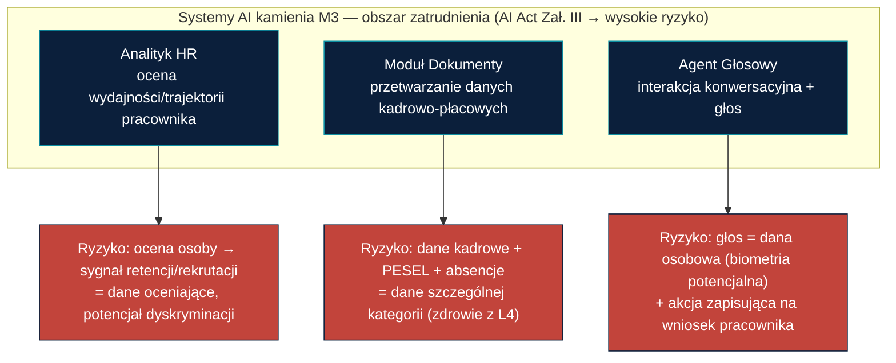
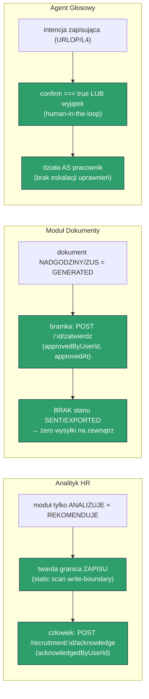
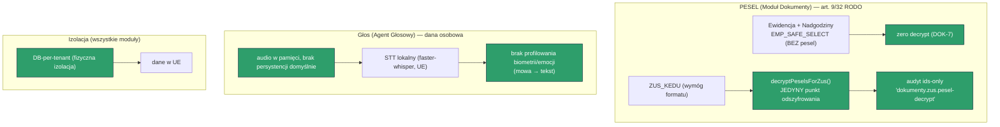

# m) Zgodność z EU AI Act i RODO — dokument przekrojowy modułów M3 (Analityk HR, Dokumenty, Agent Głosowy)

> **Punkt programu:** m) Zgodność systemów AI kamienia M3 z EU AI Act (rozporządzenie 2024/1689) oraz RODO — nadzór człowieka, transparentność, niedyskryminacja, minimalizacja danych i rozliczalność w kontekście zatrudnienia/pracowniczym (obszar wysokiego ryzyka wg AI Act)
> **Kamień milowy:** M3 (do 2026-08-20) · **Projekt:** HRobot.AI
> **Beneficjent:** App Pro sp. z o.o. (0035/2026) · **Odbiorca Technologii:** 4Mobility
> **Wersja:** 1.0 · **Status:** Zaimplementowany — dowody w kodzie i testach · **Klasyfikacja:** Poufne · **Data:** 2026-07-30
> **Identyfikowalność:** `apps/tenant-runtime/src/strategic-brain/` (Analityk HR), `apps/tenant-runtime/src/dokumenty/` (Dokumenty), `apps/tenant-runtime/src/agent-glosowy/` (Agent Głosowy), specy M3 w `docs/superpowers/specs/`, moduł Data `i-modul-data.md`

---

## 1. Cel i zakres dokumentu

Kamień M3 wprowadza trzy komponenty, które w rozumieniu EU AI Act są **systemami AI działającymi w obszarze zatrudnienia i zarządzania pracownikami** — a więc obszarze, który Załącznik III rozporządzenia 2024/1689 klasyfikuje jako **wysokiego ryzyka** (systemy używane do oceny, monitorowania i podejmowania decyzji dotyczących osób w kontekście pracy). Równolegle każdy z modułów przetwarza dane osobowe pracowników w rozumieniu RODO, a Analityk HR i Agent Głosowy dotykają wprost **art. 22 RODO** (zakaz wyłącznie zautomatyzowanej decyzji o istotnym skutku).

Ten dokument jest **przekrojowy**: nie opisuje funkcji modułów (te są w dokumentach dedykowanych — [l-modul-analityk-hr.md](l-modul-analityk-hr.md) oraz specach M3), lecz **spina w jedną całość mechanizmy zgodności** i wskazuje dla każdego z nich **konkretny dowód w kodzie lub teście**. Zasada nadrzędna dokumentu: **żadne twierdzenie o zgodności nie jest deklaratywne** — każde jest zakotwiczone w pliku źródłowym, teście automatycznym lub jawnie oznaczone jako ograniczenie etapu demo.

Trzy filary, na których stoi zgodność M3:
1. **Nadzór człowieka (AI Act Art. 14 + RODO Art. 22)** — żaden moduł nie wykonuje samodzielnie akcji o istotnym skutku dla pracownika; człowiek zawsze jest w pętli.
2. **Transparentność (AI Act Art. 50)** — użytkownik zawsze wie, że ma do czynienia z systemem AI i z materiałem demonstracyjnym.
3. **Minimalizacja i rozliczalność (RODO Art. 5, 25, 32 + AI Act Art. 12)** — dane wrażliwe (PESEL, głos) przetwarzane w najwęższym możliwym zakresie, każda operacja o skutku audytowana ids-only, dane w UE.

## 2. Klasyfikacja ryzyka per moduł

| Moduł | Rodzaj przetwarzania | Klasyfikacja ryzyka i uzasadnienie |
|-------|----------------------|-------------------------------------|
| **Analityk HR** | Ciągła ocena wydajności/terminowości/jakości/rozwoju pracownika, sygnał retencji, rekomendacja rekrutacji | **Wysokie ryzyko** — system oceniający osoby w kontekście zatrudnienia (AI Act Zał. III pkt 4a). Wynik dotyka reputacji i sytuacji zawodowej pracownika; ryzyko dyskryminacji, gdyby scoring opierał się na cechach chronionych. Mitygacja: allowlist inputu + twarda granica art. 22 (§3, §5). |
| **Moduł Dokumenty** | Ewidencja czasu pracy, nadgodziny, szkielet eksportu ZUS/KEDU z danych RCP i kadrowych | **Wysokie ryzyko / RODO** — przetwarza dane kadrowo-płacowe, w tym **PESEL** (dana krajowego identyfikatora) oraz **absencje z `LeaveRequest`** (L4 → informacja o zdrowiu, szczególna kategoria art. 9 RODO). Mitygacja: kontrolowane odszyfrowanie PESEL tylko dla ZUS + minimalizacja (§6). |
| **Agent Głosowy** | Konwersacyjne złożenie wniosku (urlop/L4) i odczyt grafiku; wejście głosowe → tekst | **Wysokie ryzyko / RODO** — interakcja konwersacyjna (AI Act Art. 50) oraz **nagranie głosu = dana osobowa** (potencjalnie biometryczna). Mitygacja: transparentność aiNotice, bramka potwierdzenia, brak profilowania biometrycznego, lokalne STT w UE (§3, §4, §6). |

## 3. Nadzór człowieka (AI Act Art. 14 + RODO Art. 22) — rdzeń dokumentu

To jest najważniejsza gwarancja M3: **żaden moduł nie zamyka pętli decyzyjnej bez człowieka**. Każdy moduł realizuje to innym, adekwatnym do swojej natury mechanizmem, i każdy mechanizm jest egzekwowany testem, nie tylko konwencją.

| Moduł | Mechanizm nadzoru człowieka | Dowód w kodzie / teście |
|-------|------------------------------|--------------------------|
| **Analityk HR** | Moduł **wyłącznie analizuje i rekomenduje** — nigdy nie mutuje stanu kadrowego/grafikowego. Nieodwracalną decyzję (np. wstrzymanie rekrutacji) zatwierdza człowiek przez `POST /recruitment/:id/acknowledge`, który loguje `acknowledgedByUserId` i **nie wykonuje żadnej akcji kadrowej**. | `write-boundary.spec.ts` — **statyczna analiza**: skanuje każdy plik `.ts` modułu i fail'uje, jeśli którykolwiek wykonuje zapis Prisma (`create/update/delete/upsert`) na modelu zakazanym (`employee`, `shift`, `shiftDemand`, `aiProposal`, `leaveRequest`, `user`, `userRole`, `accessGrant`); dopuszcza zapis wyłącznie do własnych tabel modułu. Test ma też kontrolę pozytywną (`employeePerformanceSnapshot.upsert` musi wystąpić — skan nie przechodzi „na pusto"). |
| **Moduł Dokumenty** | Dokument `NADGODZINY`/`ZUS_KEDU` powstaje w stanie `GENERATED` i staje się „ważny do rozliczenia" dopiero po `POST /api/dokumenty/:id/zatwierdz` przez MANAGER/HR (stempluje `approvedByUserId`, `approvedAt`). **Nie istnieje** stan ani ścieżka „wysyłka na zewnątrz". | `dokumenty-no-send.spec.ts` — asertuje, że enum `DocumentStatus` to dokładnie `[GENERATED, APPROVED, SUPERSEDED]` (brak `SENT`/`EXPORTED_EXTERNAL`) — zarówno w kodzie TS, jak i w autorytatywnym `schema.prisma` — oraz że **żaden plik modułu nie wykonuje wychodzącego wywołania sieciowego** (`fetch`/`axios`/`XMLHttpRequest`/URL http). Bramka: `dokumenty.controller.ts` `@Post(':id/zatwierdz')`. |
| **Agent Głosowy** | Intencja **zapisująca** (`URLOP`/`L4`) **nie wykona się bez `confirm === true`** — inaczej rzuca `BadRequestException` („Potwierdzenie człowieka jest wymagane… — EU AI Act / art. 22 RODO"). Intencja odczytu (`MOJ_GRAFIK`) może iść bez potwierdzenia. Niska pewność / `NIEZNANE` → `fallbackToForm: true`, nigdy „ciche" wykonanie. | `voice-command.service.ts` — `WRITE_INTENTS = {URLOP, L4}`; w `execute()` gałąź `if (confirm !== true) throw`. Pokryte `voice-command.service.spec.ts`. Dodatkowo agent **działa jako wywołujący** (`VoiceActor` przekazany do prawdziwych `LeaveService`/`GrafikService`) — nie ma własnych uprawnień, więc RBAC/maker-checker egzekwują istniejące serwisy (brak eskalacji). |

## 4. Transparentność (AI Act Art. 50)

Użytkownik zawsze wie trzy rzeczy: (a) że wchodzi w interakcję z systemem AI, (b) że rekomendacja AI nie jest decyzją, (c) że materiał jest demonstracyjny i nie ma mocy prawnej.

| Moduł | Realizacja transparentności | Dowód |
|-------|------------------------------|-------|
| **Analityk HR** | Stały baner „Rekomendacja AI — decyzję podejmuje człowiek" w UI + pełna **wyjaśnialność**: każdy score i sygnał rozbity na `factors` (compositeScore, slope, confidence, slaHitRate, defectRate, throughput, isNewHire, excludedReason) dostępne przez `GET /employee/:id`. | `components/strategic-brain/rodo-banner.tsx`; `factors` opisane w [l-modul-analityk-hr.md](l-modul-analityk-hr.md) §8. |
| **Agent Głosowy** | Każda odpowiedź (`interpret` i `execute`) niesie stałe `aiNotice`: **„Asystent AI HRobot — rozmawiasz z systemem AI (nie z człowiekiem). Akcje zapisujące wymagają potwierdzenia człowieka."** Agent nie udaje człowieka. | `voice-command.service.ts` — stała `AI_NOTICE`, dołączana do `InterpretResult` i `ExecuteResult`. |
| **Moduł Dokumenty** | Każdy wygenerowany PDF nosi **widoczny znak wodny** (ukośna nakładka + linia tekstu): „WERSJA DEMO — dane syntetyczne — nie do obrotu prawnego / nie do wysyłki ZUS"; XML KEDU ma komentarz nagłówkowy DEMO + element `<demo>true</demo>`. | `render/pdf.renderer.ts` — stała `WATERMARK_TEXT` na każdym dokumencie (test `pdf.renderer.spec.ts`); `render/kedu-xml.renderer.ts` — komentarz + `<demo>true</demo>` (test `kedu-xml.renderer.spec.ts`). |

## 5. Uczciwość i niedyskryminacja

Rdzeń antydyskryminacyjny to **allowlist inputu scoringu** w Analityku HR: scorer widzi wyłącznie jawnie wymienione sygnały operacyjne i **rzuca wyjątek przy jakimkolwiek innym kluczu** — co dowodzi braku *proxy* cechy chronionej, nie tylko braku jej nazwy.

- **Allowlist, nie denylist (`scoring-input.ts`):** `buildScoringInput()` kopiuje wyłącznie klucze z `ALLOWED_KEYS = {throughput, completedCount, complaintCount, cycleMinutes, slaHits, peerGroupKey, hiredAt}` i **rzuca** na dowolnym nieoczekiwanym kluczu (`"unexpected key … entered scorer (M11 proxy-guard)"`). Brak w zbiorze: wieku, płci, pochodzenia, stanu zdrowia — ani żadnego ich proxy (adres/lokalizacja, typ etatu). Rozszerzenie zbioru to świadoma, recenzowana zmiana. Dowód: `scoring-input.spec.ts`.
- **Wykluczenia L4/urlop/onboarding z trendu:** okno z `excludedReason ∈ {L4, URLOP, ONBOARDING}` jest **pomijane** w regresji trajektorii rozwoju — powrót z L4 nie zaniża oceny. `excludedReason` wyprowadzany strukturalnie z przecięcia dat `LeaveRequest.APPROVED`, nie ze zgadywania. Dowód: `snapshot.service.spec.ts` (`structural exclusions`), przykład live serii Anny Kowalskiej w [l-modul-analityk-hr.md](l-modul-analityk-hr.md) §8.
- **Peer-group + ochrona małych/nowych grup:** normalizacja percentylowa w grupie `rola|jednostka|etat` z drabinką fallbacku; grupa `< minPeerGroupSize(5)` → kara pewności i oznaczenie „normalizacja orientacyjna" (ochrona przed re-identyfikacją i fałszywym sygnałem dla nowych pracowników).
- **Null ≠ ryzyko:** brak danych nigdy nie zamienia się w sygnał `RYZYKO` — zawsze `OBSERWOWAC` (M9), więc pracownik z krótką historią nie jest karany za brak obserwacji.

## 6. Dane osobowe, minimalizacja i RODO

| Wymóg RODO | Realizacja w M3 | Dowód |
|------------|------------------|-------|
| **Minimalizacja PESEL (art. 5.1c)** | Ewidencja i nadgodziny liczone na `EMP_SAFE_SELECT` (id, imię, nazwisko, position, unitId, etat) — **zero PESEL, zero decrypt**. PESEL odszyfrowywany **wyłącznie** w jednym miejscu (`decryptPeselsForZus`), tylko dla generacji/pobrania `ZUS_KEDU`, i nie trafia do `computedFacts` ani logów. | `dokumenty.service.ts` — `EMP_SAFE_SELECT` (bez `pesel`); pojedyncza ścieżka `decryptEmployeePesel` w `decryptPeselsForZus` (DOK-7/DOK-8). |
| **Kontrolowane + audytowane odszyfrowanie** | Każde odszyfrowanie PESEL emituje wpis audytowy `dokumenty.zus.pesel-decrypt` z payloadem **ids-only** (`{documentId, employeeIds}`) — bez PESEL, bez nazwisk. | `dokumenty.service.ts` `decryptPeselsForZus` → `audit.log`. |
| **Minimalizacja w projekcjach** | Listy/metadane dokumentów przez `DOC_SAFE_SELECT` — bez treści i bez PESEL. `computedFacts` = tylko id + liczby. Analityk HR: audyt `acknowledge` konstruowany ręcznie jako `{recommendationId}`, bez PII. | `DOC_SAFE_SELECT`; `strategic-brain` acknowledge (patrz [l-modul-analityk-hr.md](l-modul-analityk-hr.md) §8 AN-7). |
| **Głos = dana osobowa (art. 4.1)** | Audio przetwarzane w pamięci, **nie persystowane domyślnie**; STT lokalny (faster-whisper w UE) → audio nie opuszcza infrastruktury UE; **brak profilowania biometrii/emocji** (mowa → tekst). Tryb tekstowy zawsze dostępny (łatwe wyłączenie mikrofonu). | `stt.port.ts` (dokumentacja szwu STT) + PoC `docs/superpowers/specs/2026-07-21-agent-glosowy-poc.md` §5. |
| **Izolacja i rezydencja danych** | Każdy tenant ma **fizycznie osobną bazę** (DB-per-tenant); dane pozostają w UE. Treść dokumentu ZUS zawierająca PESEL chroniona izolacją bazy + brakiem PESEL w API listy. | Model izolacji z [i-modul-data.md](i-modul-data.md) §7; storage treści opcja A (SPEC Dokumenty §4.4). |
| **Retencja (art. 5.1e)** | `GeneratedDocument.retentionUntil` ustawiane przy generacji (`periodEnd + okres ustawowy`). **Uwaga honesty:** wartość okresu jest poglądowa (do potwierdzenia radcy), a realny job czyszczący jest zakresem rozwojowym — pole jest ustawiane, ale automatyczne kasowanie nie jest jeszcze wdrożone. | `dokumenty.service.ts` `retentionUntil()`; ograniczenie opisane w §8. |

## 7. Logowanie i rozliczalność (AI Act Art. 12)

AI Act Art. 12 wymaga automatycznego rejestrowania zdarzeń systemu wysokiego ryzyka. HRobot realizuje to jednym, wspólnym mechanizmem audytu w warstwie tenanta:

- **`audit_log` jest append-only** — trigger bazodanowy blokuje `UPDATE`/`DELETE` (kryterium ID-6 z [i-modul-data.md](i-modul-data.md)). Zapis zdarzenia nie może być po fakcie zmieniony ani skasowany.
- **Payloady ids-only** — każda operacja o skutku (`agent-glosowy.execute`, `dokumenty.generuj`/`zatwierdz`/`pobierz`, `dokumenty.zus.pesel-decrypt`, `recruitment acknowledge`) zapisuje payload złożony ręcznie z samych identyfikatorów i liczb — bez PESEL, nazwisk czy wolnego tekstu. Interceptor `redactAuditPayload` dodatkowo redaguje `pesel` (obrona wielowarstwowa), ale payloady z założenia go nie zawierają.
- **Kto/kiedy/co** — każdy wpis niesie `actorUserId`, `action`, `entityType`/`entityId`, `ipAddress`, `createdAt` — pełny ślad decyzji człowieka (np. `confirmedByHuman` w Agencie, `approvedByUserId` w Dokumentach, `acknowledgedByUserId` w Analityku).

## 8. Ograniczenia etapu demo (uczciwość)

Zgodnie z zasadą uczciwości dokumentu — poniższe elementy są **świadomie ograniczone do demo** i oznaczone jako takie w kodzie i w wygenerowanych artefaktach:

| Obszar | Ograniczenie | Jak oznaczone |
|--------|--------------|----------------|
| **Wartości prawne (Dokumenty)** | Normy czasu pracy, stawki dodatków nadgodzinowych (50%/100%), pora nocna, kalendarz świąt, wersja schematu KEDU, okresy retencji — są **poglądowe** i wymagają weryfikacji radcy prawnego / specjalisty kadrowo-płacowego 4Mobility. | `dokumenty.config.ts` (`DEMO_CONFIG`, jawnie oznaczony); znaczniki 🔴/⚖️ w SPEC Dokumenty §11/§14/§15. |
| **Brak realnej wysyłki ZUS** | KEDU to **szkielet strukturalny** (DRA/RCA/RSA) na danych syntetycznych, walidowalny strukturalnie ale **nie zdatny do realnej wysyłki**; brak podpisu kwalifikowanego, brak integracji z Płatnikiem. | `<demo>true</demo>` + komentarz DEMO w XML; brak stanu `SENT` (test `dokumenty-no-send.spec.ts`). |
| **STT Agenta Głosowego** | Warstwa mowa→tekst jest **udokumentowanym szwem poza modułem NestJS** — moduł jest w pełni używalny przez **tekst** (podstawowa powierzchnia demo). Rekomendowany adapter faster-whisper `small` (PL) to wynik PoC/feasibility, **nie został zainstalowany ani zbudowany** jako część M3. | `stt.port.ts` (interfejs bez implementacji) + PoC `2026-07-21-agent-glosowy-poc.md` (status: PoC/feasibility). |
| **Retencja dokumentów** | Pole `retentionUntil` jest ustawiane, ale **automatyczny job czyszczący** to zakres rozwojowy. | `dokumenty.service.ts` `retentionUntil()`; nota w §6. |
| **Dane** | Wszystkie trzy moduły działają na danych **syntetycznych** (kotwice demo: 36 pracowników, 832 zmiany — nietknięte). | SPEC Dokumenty §8; [l-modul-analityk-hr.md](l-modul-analityk-hr.md) §2 (greenfield, zero realnego PII). |

## 9. Kryteria akceptacji zgodności (EAI-1 … EAI-12)

| # | Kryterium (wymóg AI Act / RODO) | Weryfikacja (plik / test / mechanizm) |
|---|----------------------------------|----------------------------------------|
| **EAI-1** | Nadzór człowieka — Analityk HR: moduł nigdy nie mutuje stanu kadrowego/grafikowego (twarda granica art. 22) | `strategic-brain/write-boundary.spec.ts` (statyczny skan zapisów Prisma na modelach zakazanych vs własnych + kontrola pozytywna `employeePerformanceSnapshot.upsert`) |
| **EAI-2** | Nadzór człowieka — Dokumenty: nadgodziny/ZUS wymagają zatwierdzenia człowieka; brak jakiejkolwiek wysyłki na zewnątrz | `dokumenty/dokumenty-no-send.spec.ts` (enum bez `SENT`/`EXPORTED_EXTERNAL` w TS i Prisma; brak wywołań sieciowych) + `dokumenty.controller.ts` `@Post(':id/zatwierdz')` |
| **EAI-3** | Nadzór człowieka — Agent Głosowy: akcja zapisująca nie wykona się bez potwierdzenia człowieka; niska pewność → fallback tekstowy | `agent-glosowy/voice-command.service.ts` (`WRITE_INTENTS` + `if (confirm !== true) throw`) + `voice-command.service.spec.ts` |
| **EAI-4** | Transparentność (Art. 50): użytkownik wie, że to AI / rekomendacja, nie decyzja / materiał demo | Agent: stała `AI_NOTICE` w `voice-command.service.ts`; Analityk: `components/strategic-brain/rodo-banner.tsx`; Dokumenty: `WATERMARK_TEXT` + `<demo>true</demo>` (`pdf.renderer.spec.ts`, `kedu-xml.renderer.spec.ts`) |
| **EAI-5** | Niedyskryminacja — brak cech chronionych i proxy w scoringu (allowlist, nie denylist) | `strategic-brain/scoring-input.ts` (`ALLOWED_KEYS`, rzut na nieoczekiwanym kluczu) + `scoring-input.spec.ts` |
| **EAI-6** | Niedyskryminacja — L4/urlop/onboarding nie zaniżają trendu rozwoju (strukturalne wykluczenie) | `strategic-brain/snapshot.service.spec.ts` (`structural exclusions`) |
| **EAI-7** | Minimalizacja PESEL — odszyfrowanie kontrolowane, tylko dla ZUS, z audytem ids-only | `dokumenty/dokumenty.service.ts` `decryptPeselsForZus` → audyt `dokumenty.zus.pesel-decrypt` (DOK-8) |
| **EAI-8** | Minimalizacja PESEL — ewidencja/nadgodziny liczone bez odszyfrowania (SAFE_SELECT) | `dokumenty.service.ts` `EMP_SAFE_SELECT` (bez `pesel`), DOK-7 |
| **EAI-9** | Rozliczalność (AI Act Art. 12) — audyt append-only, payloady ids-only, we wszystkich trzech modułach | trigger `audit_log` (ID-6 z `i-modul-data.md`) + payloady ids-only: `agent-glosowy.execute`, `dokumenty.*`, `recruitment acknowledge` |
| **EAI-10** | Głos jako dana osobowa — minimalizacja/rezydencja UE, brak biometrii/emocji, tryb tekstowy | `agent-glosowy/stt.port.ts` (audio niepersystowane, STT lokalny UE, mowa→tekst) + PoC §5 |
| **EAI-11** | Izolacja i rezydencja danych — fizyczna baza per tenant, dane w UE | model izolacji `i-modul-data.md` §7; storage treści opcja A (SPEC Dokumenty §4.4) |
| **EAI-12** | Uczciwość demo — wartości prawne poglądowe, brak realnej wysyłki ZUS, STT niezbudowane — wszystko oznaczone | `dokumenty.config.ts` `DEMO_CONFIG`; `<demo>true</demo>` + `WATERMARK_TEXT`; `stt.port.ts` (szew bez implementacji); §8 tego dokumentu |

## 10. Powiązane dokumenty

- Moduł Analityk HR (write-boundary, allowlist scoringu, wykluczenia, RBAC, art. 22): [l-modul-analityk-hr.md](l-modul-analityk-hr.md)
- SPEC Modułu Dokumenty (model RCP, silnik nadgodzin, PESEL/ZUS, brak wysyłki): [`docs/superpowers/specs/2026-07-21-modul-dokumenty-SPEC.md`](../superpowers/specs/2026-07-21-modul-dokumenty-SPEC.md)
- PoC Agent Głosowy (STT lokalny vs API, EU AI Act + RODO, zamknięty zbiór komend): [`docs/superpowers/specs/2026-07-21-agent-glosowy-poc.md`](../superpowers/specs/2026-07-21-agent-glosowy-poc.md)
- Moduł Data (szyfrowanie PESEL, izolacja per tenant, audyt append-only — fundament RODO): [i-modul-data.md](i-modul-data.md)
- Moduł Dostępy (uwierzytelnianie OIDC, RBAC wzorcowy, RCP jako źródło danych): [k-modul-dostepy.md](k-modul-dostepy.md)
