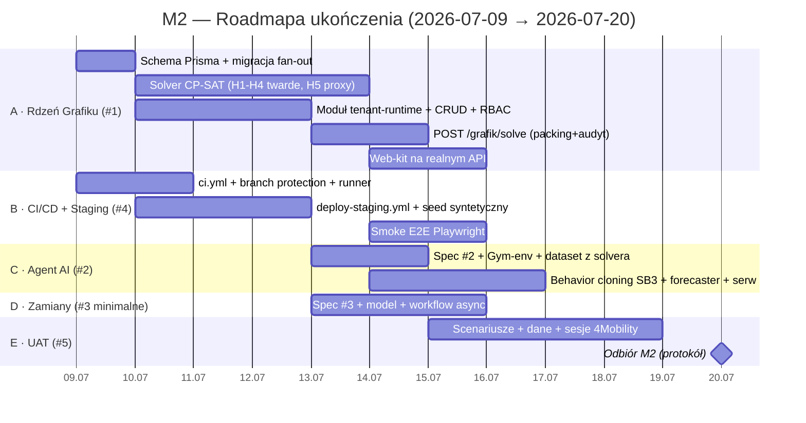

# M2 · Roadmapa ukończenia Kamienia Milowego 2

> **Projekt:** HRobot.AI — Kamień Milowy **M2** (odbiór **20.07.2026**)
> **Punkty programu:** a) Grafik · b) Agent AI Grafik Manager · c) Real-time + zamiany zmian · d) CI/CD · e) Środowisko testowe Etapu 2 · f) UAT Etapu 2
> **Beneficjent:** App Pro sp. z o.o. (0035/2026) · **Odbiorca Technologii:** 4Mobility · **Transza II:** 129 600 PLN
> **Repozytorium:** `github.com/twilk/HRobotAI` · **Gałąź:** `main`
> **Data:** 2026-07-09 · **Status:** Plan wykonawczy (po review /autoplan + korekcie kapitana)
> **Zakres ZATWIERDZONY (2026-07-09):** strategia **deep-2 + renegocjacja** — zagwarantuj 2 moduły-wskaźniki (a Grafik + b Agent AL), c/d/e/f best-effort; proaktywnie uzgodnij etapowość z 4Mobility.
> **Wizja modułu b (korekta kapitana):** nie statyczna imitacja, lecz **agent samouczący się, wnioskujący, samorozwijający i samoleczący błędy**. Imitacja z solvera = tylko zimny start; wartość = pętla ciągłego uczenia z feedbacku operacyjnego. SB3/RL utrzymane. M2 dostarcza demonstrowalny inkrement tej wizji (patrz spec #2).
> **Autor:** planowanie na bazie ocen kodu + spec #1/#4 + review /autoplan (3 głosy)
> **Powiązane:** `2026-07-06-m2-p1-rdzen-grafiku-design.md` (#1) · `2026-07-06-m2-cicd-srodowisko-testowe-design.md` (#4)

---

## 1. Stan faktyczny (na 2026-07-09) — audyt kodu

**11 dni kalendarzowych do odbioru (8 dni roboczych + 2 weekendy).** Ogólne ukończenie M2 ≈ **6%**.

| # | Podprojekt | Punkt | Ukończenie | Co JEST | Co BLOKUJE |
|---|-----------|:-----:|:----------:|---------|-----------|
| 1 | **Rdzeń Grafiku** | a | **~10%** | Prototyp UI (`docs/design/web-kit`: siatka, actions, API-stuby — in-memory, ~50%); `EncryptionService`; modele `Employee/Lokalizacja/Pojazd/LeaveRequest` | ❌ modele Prisma (`Shift/ShiftDemand/ShiftTemplate` + rozszerzenia `Employee`) · ❌ moduł `tenant-runtime/src/grafik` · ❌ serwis Python `grafik-optimizer` (CP-SAT) · ❌ geokod/dojazdy |
| 2 | **Agent AI Grafik Manager** | b | **0%** | — (brak specyfikacji) | ❌ całość: Gym-env, SB3, forecasting, pipeline treningowy; zależy od #1 |
| 3 | **Real-time + zamiany zmian** | c | **0%** | — (brak specyfikacji) | ❌ całość: WS/SSE, model `ShiftSwapRequest`, workflow; zależy od #1 |
| 4 | **CI/CD + Staging Etapu 2** | d+e | **~15%** | `docker-compose.yml --profile full` (100%: PG×2, Redis, RabbitMQ, Keycloak, apps, tunel); Jest skonfigurowany | ❌ `.github/workflows/` NIE ISTNIEJE (ci.yml, deploy-staging.yml) · ❌ self-hosted runner · ❌ Playwright · ❌ seed UAT |
| 5 | **UAT Etapu 2** | f | **~5%** | `facilities.ts` (~15 lokalizacji ref.) | ❌ dane syntetyczne (~36 prac.) · ❌ scenariusze/kryteria akceptacji |

**Kluczowe fakty z audytu:**
- UI grafiku żyje **wyłącznie w `docs/design/web-kit`** (design kit, in-memory) — produkcyjne `apps/web`/`tenant-runtime` nie mają modułu grafiku. Demo/UAT serwuje web-kit (tunel, port 3051 — zgodne z workflow raportów KM).
- Ostatnie commity grafiku (`f756aee`, `3dbcc66`, `5d1143e`, `37be7cf`) dotyczą **tylko** web-kit; **żaden** nie tyka schematu Prisma, `tenant-runtime`, Pythona ani CI.
- Tylko **2 z 6 punktów** mają spisaną specyfikację (#1, #4). #2, #3, #5 wymagają cyklu spec przed implementacją.

---

## 2. Werdykt zakresowy (DECYZJA KAPITANA) — realizm vs ambicja

**Twarda prawda:** zbudowanie od zera w 8 dni roboczych JEDNOCZEŚNIE (a) produkcyjnego solvera CP-SAT z pełną domeną **oraz** (b) **produkcyjnego systemu RL** (Stable-Baselines3, trening na żywych danych) jest nierealne przy klasycznym zespole. Odbiór M2 to jednak **protokół akceptacji 4Mobility (poziom UAT/demo), nie hardening produkcyjny**.

**Dźwignia to GŁĘBIA per punkt, nie usuwanie punktów** — wszystkie 6 (a–f) muszą być reprezentowane dla wskaźnika „2 moduły". Rekomendowana minimalna-akceptowalna głębia na 20.07:

| Punkt | Cel na odbiór (realny) | Ambicja przycięta → M3/po pilocie |
|:-----:|------------------------|-----------------------------------|
| **a Grafik** | ✅ **PEŁNY**: solver CP-SAT (**H1–H4 twarde**, H5 miękki proxy „≥N dni wolnych/tydz.", + cele dojazdy/etaty), persystencja, API, web-kit na realnym API, demo na stagingu | **H6 (limity godzin/nadgodziny) i fairness → M3**; OSRM (routing drogowy) — interfejs gotowy, impl. później |
| **b Agent AI** (samouczący) | ✅ **DEMONSTROWALNA PĘTLA UCZENIA**: zimny start = imitacja z solvera; wartość = pętla feedbacku (korekty menadżera → sygnał uczenia), auto-naprawa infeasible (**samolecząca**), adnotacje rationale (**wnioskująca**), retrening na akumulowanym feedbacku (**samorozwijająca**), forecaster zapotrzebowania. Demo: mierzalny spadek korekt po feedbacku na danych syntetycznych. SB3/RL utrzymane. | Długohoryzontowy RL on-policy na żywych danych 4Mobility, pełna autonomia produkcyjna → etapowo po M2 |
| **c Zamiany zmian** | ✅ **MINIMALNY**: async workflow `ShiftSwapRequest` (zgłoś → akceptacja managera/kontrahenta) na modelu `Shift` #1 | Real-time WS/SSE „pre-uzgadnianie" AI → M3 |
| **d CI/CD** | ✅ **PEŁNY**: `ci.yml` (lint→typecheck→unit→integration→smoke) + branch protection | matrix `python`, remote cache |
| **e Staging** | ✅ **PEŁNY**: `deploy-staging.yml` (self-hosted → compose full → migracje → seed → health → tunel) | K8s/Terraform (to M3, dok. `h`) |
| **f UAT** | ✅ sesje z 4Mobility na stagingu + checklista + kryteria | pełna suita E2E |

> **Ta decyzja wymaga potwierdzenia** — bo „przycięcie głębi" b/c poniżej oczekiwań 4Mobility wpływa na protokół odbioru. Jeśli 4Mobility wymaga produkcyjnego RL lub real-time zamian **w M2**, potrzebna renegocjacja zakresu/terminu (aneks). Rekomendacja: pilotowe b + minimalne c, udokumentowane jako etap.

---

## 3. Ścieżka krytyczna i tory równoległe

```
KRYTYCZNA:  [Schema Prisma] → [Kontrakt ProblemInput/SolveResult] → [Solver CP-SAT ‖ Moduł tenant-runtime] → [POST /grafik/solve] → [Web-kit na realnym API] → [Demo staging] → [UAT]
```

| Tor | Podprojekt | Start | Zależność | Wykonawca (firstmate) |
|-----|-----------|:-----:|-----------|----------------------|
| **A** | #1 Rdzeń Grafiku | D1 | — (fundament) | secondmate `sm-grafik-core` |
| **B** | #4 CI/CD + Staging | **D1 równolegle** | — (niezależny) | secondmate `sm-devops` |
| **C** | #2 Agent AI | D3 (po kontrakcie #1) | #1 kontrakt | secondmate `sm-agent-ai` |
| **D** | #3 Zamiany (minimalne) | D3 | #1 model `Shift` | crew ad-hoc / `sm-grafik-core` |
| **E** | #5 UAT | D5 | #1–#4 | main firstmate + crew |

Kontrakt `ProblemInput/SolveResult` (spec #1 §7) to **punkt synchronizacji** — gdy zamrożony (koniec D2), tory A i C ruszają niezależnie.

---

## 4. Roadmapa dzień-po-dniu



| Dzień | Data | Tor A (Grafik) | Tor B (CI/CD) | Tor C (Agent) | Tor D/E |
|:-----:|:----:|----------------|---------------|---------------|---------|
| D1 | **Czw 09.07** | Migracja Prisma: `ShiftTemplate/ShiftDemand/Shift` + `Employee`(homeAddress enc, homeLat/lng, etat, qualifications); gen. client; fan-out. Scaffold `grafik-optimizer` (FastAPI `POST /solve` stub, Dockerfile, slot `agent` w compose); scaffold `tenant-runtime/src/grafik` | `ci.yml` (lint→typecheck→unit→integration→smoke); rejestracja self-hosted runnera; branch protection `main` | — | Kick-off speców #2/#3/#5 (brainstorming równolegle) |
| D2 | **Pt 10.07** | Solver: zmienne `x[e,d]` + H1–H3; pydantic `ProblemInput/SolveResult`. tenant-runtime: CRUD Shift/Demand/Template + RBAC + audyt | `deploy-staging.yml` (workflow_run→compose full→migracje→seed→health→tunel); **seed syntetyczny 4Mobility** (~36 prac., PESEL generowany) | Spec #2 gotowa | — |
| — | Sob–Nd 11–12.07 | *(crew/bufor)* Solver: H4 (odpoczynek dobowy 11h) twarde + H5 miękki proxy „dni wolnych/tydz." (H6/fairness → M3) + cele miękkie + haversine + determinizm + `INFEASIBLE`; testy G1–G4 | — | — | Spec #3, #5 |
| D3 | **Pon 13.07** | **`POST /grafik/solve`**: packing DB→ProblemInput→optimizer→zapis `Shift(source=AUTO)`→audyt. Walidacja kontraktu 2-str. | CI zielone e2e | Serwis agenta; Gym-env na kontrakcie #1; dataset z solvera | Model `ShiftSwapRequest` + state machine |
| D4 | **Wt 14.07** | Web-kit: wypięcie z in-memory → realne API tenant-runtime; akcja „Generuj grafik"; UI zapotrzebowania | Smoke E2E Playwright (login→`/grafik` bez błędów); artefakty na raport KM | Behavior cloning polityki SB3 z danych solvera; forecaster; endpoint serwujący | Moduł zamian (async) + minimalne UI |
| D5 | **Śr 15.07** | E2E na stagingu: generacja→solver→persist→widoczne/edytowalne (G5, G6); bugfix | Health-check orchestracja stabilna | Demo agenta: metryki vs baseline solvera; **oznaczenie pilotowe** | UAT: scenariusze + checklista akceptacji |
| D6 | **Czw 16.07** | Hardening integracji A+C+D na stagingu | Pełna ścieżka smoke + artefakty KM | Integracja agenta w demo | UAT dry-run wewnętrzny; bugfix |
| D7 | **Pt 17.07** | **Feature freeze** | Zrzuty CI/E2E do raportu | — | **Sesja UAT #1 z 4Mobility**; przygotowanie protokołu + screenshotów KM |
| — | Sob–Nd 18–19.07 | *(bufor)* bugfix z UAT | — | — | Iteracja feedbacku, polish raportu |
| D8 | **Pon 20.07** | — | — | — | **Demo/UAT finalne → protokół odbioru M2 (2 moduły) podpisany przez 4Mobility** |

---

## 5. Rozbicie prac per podprojekt (deliverables + kryteria)

### #1 Rdzeń Grafiku (a) — tor A
- **Prisma:** `ShiftTemplate`, `ShiftDemand`, `Shift` (§4 spec #1) + `Employee`(`homeAddress` AES-256-GCM, `homeLat/lng`, `etat`, `qualifications`); migracja + fan-out (`migrate-all-tenants.ts`).
- **grafik-optimizer (Python/FastAPI):** `POST /solve`; CP-SAT: zmienne `x[e,d]`, **twarde H1–H4**, H5 jako miękki proxy „≥N dni wolnych/tydz." (**H6/nadgodziny i fairness → M3**), cel `w_d·dojazdy + w_e·etaty` (godziny/fairness odroczone); haversine (interfejs OSRM-ready); determinizm (seed+limit); `INFEASIBLE` + niepokryte sloty. Kontener `agent` w compose.
- **tenant-runtime/src/grafik:** CRUD (Shift/Demand/Template), `POST /grafik/solve` (packing→optimizer→persist→audyt), RBAC (MANAGER≤jednostka, HR/ADMIN globalnie).
- **web-kit:** wypięcie `lib/schedule.ts` (in-memory) → realne API; „Generuj grafik"; ręczna edycja zostaje.
- **Kryteria:** G1–G6 (spec #1 §10).

### #2 Agent AI Grafik Manager (b) — tor C
- **Spec #2** (do napisania D1–D2): Gym-env, kształt nagrody, źródło danych, zakres pilotowy.
- **Deliverables:** Gym-env owijający kontrakt #1; **behavior cloning polityki SB3** z par (ProblemInput → assignments solvera); forecaster zapotrzebowania (prosty, np. sezonowość tygodniowa); endpoint serwujący rekomendację; skrypt: wyniki solvera → dataset treningowy.
- **Kryteria (do zdefiniowania w spec #2):** agent zwraca wykonalny grafik ≥ jakości baseline na danych syntetycznych; czas inferencji < solver; demo różnicy metryk. **Jawnie: pilot ML, nie produkcyjny RL.**

### #3 Zamiany zmian (c, minimalne) — tor D
- **Spec #3** (do napisania). Model `ShiftSwapRequest` (state machine DRAFT→PENDING→APPROVED/REJECTED) na `Shift`; endpointy zgłoś/akceptuj/odrzuć; minimalne UI. **Bez WS/SSE** (async pull) — real-time AI pre-uzgadnianie → M3.

### #4 CI/CD + Staging (d+e) — tor B
- Pełna spec #4 istnieje. `ci.yml` (bramki §4), `deploy-staging.yml` (§5), runner self-hosted, seed syntetyczny (§6), branch protection.
- **Kryteria:** CI-1…CI-4, ENV-1…ENV-3 (spec #4 §8).

### #5 UAT (f) — tor E
- **Spec #5** (scenariusze + kryteria akceptacji 4Mobility). Dane syntetyczne na stagingu; sesje UAT; checklista → protokół odbioru.

---

## 6. Bramki odbiorowe (gates → grant)

| Gate | Data | Warunek | Punkty |
|------|:----:|---------|:------:|
| **GA — Kontrakt** | 10.07 | `ProblemInput/SolveResult` zamrożony; migracja zielona; CI działa | a, d |
| **GB — Solver** | 13.07 | Solver zwraca wykonalny grafik (G1–G4) na danych syntetycznych | a |
| **GC — E2E** | 15.07 | web-kit→tenant-runtime→optimizer→persist→edycja na stagingu (G5, ENV-1..3) | a, e |
| **GD — Agent+Zamiany** | 16.07 | Agent MVP serwuje rekomendację; workflow zamian działa | b, c |
| **GE — Odbiór** | **20.07** | Wszystkie 6 punktów demonstrowalne; UAT OK; protokół 4Mobility | a–f |

---

## 7. Ryzyka i mitygacje

| Ryzyko | P | Wpływ | Mitygacja |
|--------|:-:|:-----:|-----------|
| Solver za wolny / niewykonalny na realnym rozmiarze | Ś | Wys | limit czasu + akceptacja `FEASIBLE`; horyzont per region; twarde tylko H1–H4 (H5 miękki proxy, H6/fairness → M3) |
| Agent AI (#2) nie zdąży do produkcyjnego RL | **Wys** | Wys | **z góry pilot: imitation learning z solvera** — działający ML bez treningu on-policy; udokumentować jako etap |
| Kontrakt #1↔optimizer się rozjeżdża | Ś | Ś | wspólny schemat + walidacja Zod/pydantic 2-str.; zamrożenie na GA |
| Self-hosted runner na Windows (deva offline w UAT) | Ś | Wys | health-check + alert; ścieżka awaryjna ręczny `docker compose up`; sesje UAT umawiane |
| Punkt c/b poniżej oczekiwań 4Mobility na odbiorze | Ś | **Kryt** | **potwierdzić zakres z 4Mobility TERAZ**; ewentualny aneks; protokół opisuje etapowość |
| 8 dni roboczych to za mało dla solo-deva | **Wys** | Wys | **równoległe wykonanie przez firstmate crew** (§9); tory A/B/C niezależne |

---

## 8. Specyfikacje podprojektów — KOMPLET (napisane 2026-07-09)

Wszystkie 5 podprojektów ma spec (warunek wejścia w implementację spełniony):
1. **#1 Rdzeń Grafiku** — `2026-07-06-m2-p1-rdzen-grafiku-design.md`
2. **#2 Agent AI (samouczący)** — `2026-07-09-m2-p2-agent-ai-grafik-manager-design.md` (pętla uczenia: samoucząca/wnioskująca/samorozwijająca/samolecząca; SB3/RL utrzymane; inkrement M2 vs wizja etapowa)
3. **#3 Zamiany zmian** — `2026-07-09-m2-p3-zamiany-zmian-design.md` (minimalny async; real-time/AI-mediacja → M3)
4. **#4 CI/CD + Staging** — `2026-07-06-m2-cicd-srodowisko-testowe-design.md`
5. **#5 UAT + Evidence Pack** — `2026-07-09-m2-p5-uat-evidence-pack-design.md` (5 user-journey DoD, pakiet dowodowy odbioru, fallback, checklista RODO)

---

## 9. Wykonanie przez firstmate (dom HRobot)

Roadmapa mapuje się 1:1 na równoległe tory firstmate (dom `~/fm-hrobot`, `direct-PR` → `twilk/HRobotAI`):

| Secondmate | Tor | Zakres |
|-----------|:---:|--------|
| `sm-grafik-core` | A | #1 pełny: Prisma, optimizer, tenant-runtime, web-kit wiring |
| `sm-devops` | B | #4: ci.yml, deploy-staging.yml, runner, seed |
| `sm-agent-ai` | C | #2: Gym-env, behavior cloning SB3, forecaster |
| main firstmate | D/E | #3 minimalne, #5 UAT, koordynacja kolejności PR, gates |

Kolejność PR: schema/kontrakt (#1 baza) **przed** zależnymi; sekwencjonować pliki współdzielone (schema, compose, package.json).

---

## 10. Decyzja + następny krok

**Potrzebuję jednej decyzji, zanim ruszymy:** czy akceptujesz **rekomendowany zakres** (§2 — a/d/e/f pełne, b pilotowy ML z imitation learning, c minimalny async), czy celujemy w pełną ambicję (produkcyjny RL + real-time zamiany) z ryzykiem poślizgu poza 20.07?

Po decyzji mogę: (1) napisać brakujące specyfikacje #2/#3/#5, (2) rozpisać backlog firstmate i odpalić tory A/B równolegle, (3) przepuścić tę roadmapę przez `/plan-ceo-review` lub `/autoplan` jako pressure-test.

---

## GSTACK REVIEW REPORT (2026-07-09, /autoplan — 3 niezależne głosy: Codex + CEO subagent + Eng subagent)

**Werdykt zbiorczy: termin 20.07 NIE jest bezpieczny w obecnym kształcie.** Wszystkie trzy głosy zbieżnie: architektura poprawna, ale (1) plan jest „inżyniersko-artefaktowy" i pomija governance odbioru grantowego, (2) solver CP-SAT na ścieżce krytycznej jest niedoszacowany i wciśnięty w weekendowy „bufor", (3) głos #2 (Agent AI) w obecnym framingu SB3/RL jest „teatrem" i ryzykiem demo. Bezpieczny zakres istnieje, ale wymaga głębszych cięć niż obecny plan.

### Tabela konsensusu — CEO (strategia/zakres)
| Wymiar | Werdykt (oba głosy) |
|---|---|
| Premisy poprawne | **CONCERN** — nośna premisa „6 punktów, głębia to dźwignia" nigdy nie skonfrontowana z realnym instrumentem odbioru (protokół 4Mobility niecytowany) |
| Właściwy problem | **CONCERN** — bramka koniunkcyjna: 6 punktów = 6 sposobów na porażkę; lepiej zagwarantować 2 moduły-wskaźniki |
| Kalibracja zakresu | **CONCERN** — b jako imitacja solvera to liability demo; c/f bez speców na D0 |
| Alternatywy zbadane | **CONCERN** — fałszywa binarność; brak opcji „deep-2 + proaktywna renegocjacja etapowości" |
| Ryzyko odbioru grantu | **CONCERN (krytyczne)** — kryteria niecytowane, brak evidence pack, brak ścieżki częściowego protokołu |
| Trajektoria terminu | **CONCERN** — brak float, UAT za późno (D7), 3/6 deliverables bez speców |

### Tabela konsensusu — Eng (architektura/feasibility)
| Wymiar | Werdykt |
|---|---|
| Architektura (web→NestJS→bezstanowy optimizer) | **CONFIRMED** — czysty podział, wzorce modułów już istnieją |
| Kontrakt jako punkt synchronizacji | **CONFIRMED** (data freeze = CONCERN) — zamroź *kopertę* D2, pola addytywne do D3; realny sync = pierwszy pionowy plaster e2e |
| CP-SAT wykonalny w czasie | **CONCERN** — H1-H3 łatwe; H4/H5 (odpoczynek) + wariancja fairness + determinizm niedoszacowane |
| Pilot SB3 spójny | **CONCERN** — behavior cloning jest OK, ale „Gym-env + SB3 RL" to naddatek; czysty BC nie potrzebuje SB3/Gym |
| Pokrycie testów/edge | **CONCERN** — izolacja tenantów (G6), fan-out CI-4 bez fixture; test determinizmu źle zdefiniowany |
| Merge-order bezpieczny | **CONCERN** — 3 crew na `schema.prisma`/`docker-compose.yml`/`package.json`; reguła jest, mechanizmu brak |

### Motywy przekrojowe (zgłoszone przez ≥2 głosy niezależnie)
1. **Kryteria odbioru niezweryfikowane + brak evidence pack + brak fallbacku** (Codex #7/#10/#11 + CEO C1/C3) — KRYTYCZNE.
2. **b (SB3) to teatr/liability → przeframować na forecaster + uczciwą imitację** (Codex #3 + CEO H2 + Eng).
3. **Ryzyko merge równoległych crew → integration owner + kolejność PR + sm-grafik-core wyłącznym właścicielem schema/compose** (Codex #9 + Eng).
4. **Solver na ścieżce krytycznej, a zaplanowany w weekendowym buforze; brak realnego float** (CEO H3 + Eng C3).
5. **CI/CD mniej gotowe niż 15% — skrypty `typecheck`/`test:integration`/`test:e2e:smoke` i serwis `agent` w compose NIE ISTNIEJĄ; vitest, nie Jest** (Eng C2 + Codex #8).

### Poprawki przyjęte (auto-decyzja wg zasad completeness/action — do wniesienia w spece A i backlog B)
- **Determinizm G3:** `num_search_workers=1` + stały seed; porównuj *wartość celu + kanoniczny* przydział, asercja przy `OPTIMAL`. Rozmiar syntetyczny mały → OPTIMAL w limicie.
- **Twarde ograniczenia:** ship H1-H4 twarde + dojazdy(haversine) + odchyłka etatu (L1). **H5 → miękki proxy „≥N dni wolnych/tydz."** (horyzont 1-tyg. nie modeluje rolling-35h); **fairness-wariancja → M3** lub liniowy max-min.
- **Geokoder:** tylko haversine na syntetycznych lat/lng; **Nominatim/OSM → M3** (nie stawiamy kontenera OSM w M2).
- **Harmonogram solvera:** twarde ograniczenia na D2-D3 (nie w weekend); weekend = realny float.
- **Kontrakt:** freeze koperty D2, addytywne do D3; **pierwszy pionowy plaster e2e (schema+seed+stub-solve+persist+UI) jako realny kamień synchronizacji**.
- **CI/CD:** najpierw *napisać* brakujące targety turbo + minimalny Playwright (traktować jako ~5%, nie 15%); runner self-hosted tylko `push`/`workflow_run` na `main` (nigdy fork-PR), user nieuprzywilejowany; podział mandatory/opcjonalne.
- **Integracja:** integration owner; `sm-grafik-core` wyłącznym właścicielem `schema.prisma` i `docker-compose.yml`; PR-szkielet schema+kontrakt+compose ląduje D1 przed forkiem prac; merge liniowy do `main`.
- **Dane:** kanoniczny zbiór syntetyczny zamrożony D2 (15 lok., 36 prac., ≥1 tydz. feasible + 1 infeasible); seed idempotentny (upsert).
- **Dodać do zakresu:** (a) **evidence pack** (macierz a-f → artefakt demo, screeny, linki CI, URL staging, skrypt UAT, szablon sign-off), (b) **fallback demo** (prekomputowany snapshot grafiku), (c) **5 krytycznych user-journey jako produktowy DoD**, (d) **checklista RODO/security stagingu**.
- **4Mobility:** sesja potwierdzenia wymagań w pierwsze 2-3 dni (na istniejącym prototypie web-kit ~50%) — łączy się z ekstrakcją kryteriów odbioru.

### Decyzje otwarte dla kapitana (NIE auto-decydowane — patrz gate poniżej)
- **UC1 — framing b:** wszystkie 3 głosy chcą zmienić zatwierdzony zakres b (SB3/Gym-env imitacja) na forecaster-led + uczciwie oznaczona imitacja nadzorowana.
- **UC2 — strategia zakresu + ryzyko grantu:** „reprezentuj 6 na przyciętej głębi" (obecne) vs „zagwarantuj 2 moduły-wskaźniki + proaktywnie uzgodnij etapowość z 4Mobility TERAZ".
- **Warunek wstępny (krytyczny, akcja użytkownika):** zdobyć dosłowne brzmienie kryteriów odbioru M2 (umowa PARP + protokół 4Mobility) w ciągu 24-48h, PRZED kodem — to gatuje UC1/UC2.
